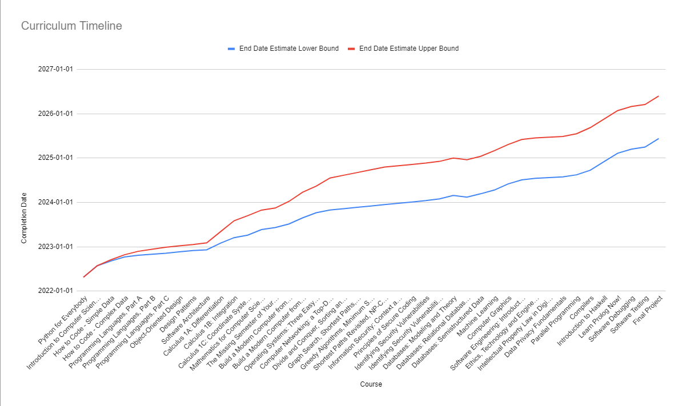

# Graduation in Computer Science by [OSSU](https://github.com/ossu/computer-science)

🎓 Follow along my path to a free self-taught education in Computer Science with OSSU! 
  
This repository houses my progress and projects that I worked on or am currently working on during my self-taught education in Computer Science. 
  
I loved working in each and every project in this repository. Feel free to have a look around and use code and data to enhance your studies as well!

# Graduation Description

The OSSU curriculum is a complete education in computer science using online materials. It's not merely for career training or professional development. It's for those who want a proper, well-rounded grounding in concepts fundamental to all computing disciplines, and for those who have the discipline, will, and (most importantly!) good habits to obtain this education largely on their own, but with support from a worldwide community of fellow learners.

It is designed according to the degree requirements of undergraduate computer science majors, minus general education (non-CS) requirements, as it is assumed most of the people following this curriculum are already educated outside the field of CS. The courses themselves are among the very best in the world, often coming from Harvard, Princeton, MIT, etc., but specifically chosen to meet the quality criteria.
 

# Planned timeline

# Courses Avaliable in this repository
 

## Intro CS

 

### Introduction to Programming

**Topics covered**:
`simple programs`
`simple data structures`

Courses | Start Date | End Date | Repo link 
:-- | :--: | :--: | :--: 
[Python for Everybody](https://www.py4e.com/lessons) | 14/02/2022 | - | [Repo](https://github.com/RaphaelLMendes/Python_for_Everybody_PY4E)
 

### Introduction to Computer Science

**Topics covered**:
`computation`
`imperative programming`
`basic data structures and algorithms`
`and more`

Courses | Start Date | End Date | Repo link 
:-- | :--: | :--: | :--: 
[Introduction to Computer Science and Programming using Python](https://www.edx.org/course/introduction-to-computer-science-and-programming-7) ([alt](https://ocw.mit.edu/courses/electrical-engineering-and-computer-science/6-0001-introduction-to-computer-science-and-programming-in-python-fall-2016/)) | - | - | -
